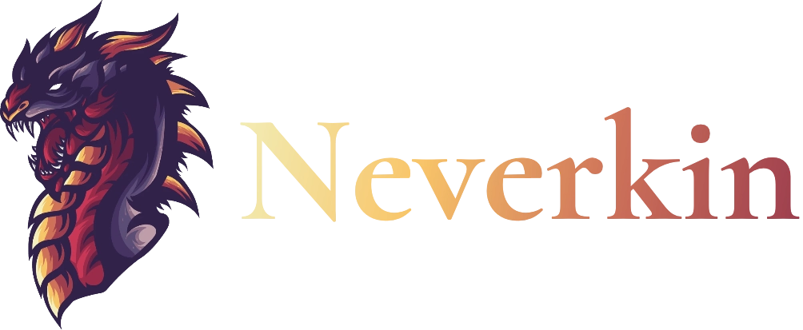
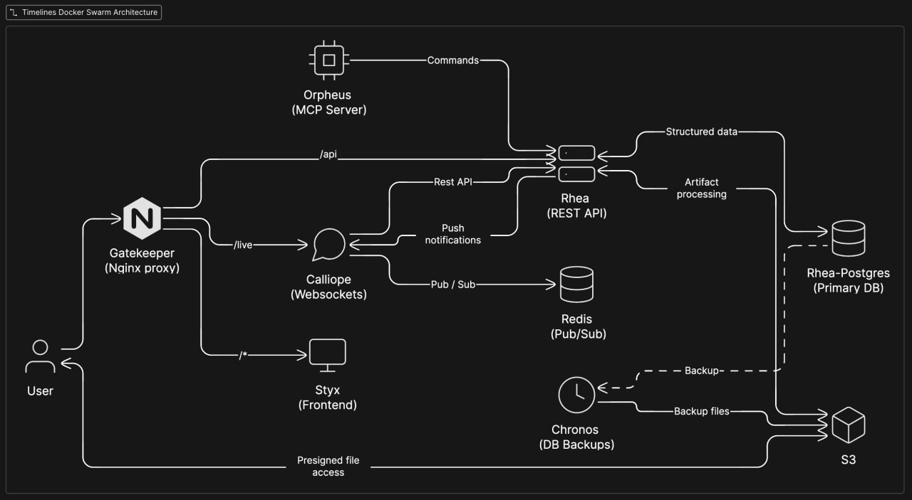

<p align="center">
  <a href="https://neverkin.com/">
    <br>
  </a>
</p>

# Introduction

[](https://github.com/Tenebrie/timelines/actions/workflows/pullRequest.yml)
[](https://github.com/Tenebrie/timelines/actions/workflows/deploy.yml)

Neverkin is an open-source collaborative writing and worldbuilding app for storytellers, DMs, writers and novelists. Organize timelines, characters, lore, and interconnected stories online in real-time.

Formerly known internally as Timelines, which is a name still used across the repository.

## Live Deployments

- **Production**: https://neverkin.com/
  - Manually deployed stable release
- **Staging**: https://staging.neverkin.com/
  - Hot updated directly from the `dev` branch

## Architecture

The application is built using the microservice architecture for Docker Swarm. The following diagram illustrates the main moving parts:



### Frontend (Styx)
- **[React](https://react.dev/)**
- **[TypeScript](https://www.typescriptlang.org/)**
- **[Vite](https://vitejs.dev/)**
- **[TanStack Router](https://tanstack.com/router)**
- **[Redux Toolkit](https://redux-toolkit.js.org/)** + **[RTK Query](https://redux-toolkit.js.org/rtk-query/overview)**
- **[Material UI](https://mui.com/)**
- **[Tiptap](https://tiptap.dev/)**

### Backend (Rhea & Calliope)
- **[Koa.js](https://koajs.com/)**
- **[Prisma ORM](https://www.prisma.io/)**
- **[PostgreSQL](https://www.postgresql.org/)**
- **[Moonflower](https://github.com/tenebrie/moonflower)**
- **[Redis](https://redis.io/)**

### Proxy (Gatekeeper)
- **[Nginx](https://nginx.org/)**

### Infrastructure
- **[Docker](https://www.docker.com/)** + **[Docker Swarm](https://docs.docker.com/engine/swarm/)**
- **[Nginx](https://nginx.org/)**

# Running the app

The development environment requires Node, Yarn and Docker to run.

In most cases, the following commands are enough to have the entire environment up and running:

- `yarn` <!-- Install dependencies -->
- `yarn dev` <!-- Run dev environment through Docker -->

The migrations are run automatically via a docker-compose task on environment start-up.

The default admin user is `admin@localhost` with password `q`.

## Useful commands

For a quick update on a running environment after a dependency update, change to Prisma types, creating a new migration, change to tsconfig.json or another change to package.json, you can either just restart the containers, or use the following:

```sh
yarn docker:update
```

> Note: The containers should be running for this command to work.

---

In case of issues with containers, try a full rebuild without cache:

```sh
yarn docker:build
```
